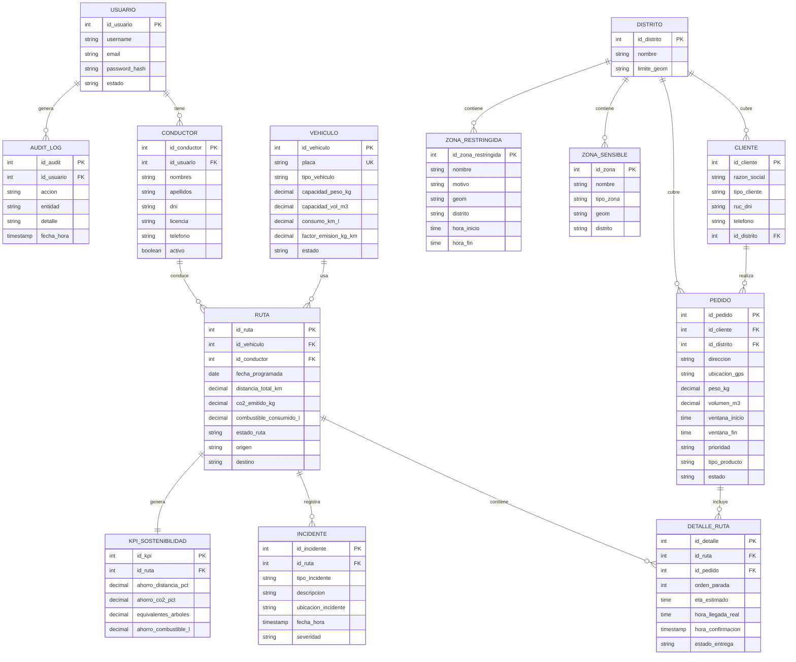
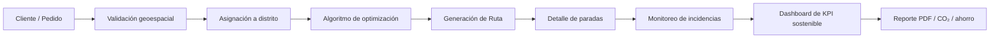

# 11. Base de datos V_1_0_3.md

### 1. Modelo Conceptual (ER) adaptado a EcoLogística Huancayo

La estructura de datos se adapta al entorno real del proyecto: rutas dentro de los distritos de Huancayo, El Tambo y Chilca; gestión de flota; entregas con ventanas de tiempo; monitoreo de zonas sensibles; y métricas de sostenibilidad.

Se mantiene la relación `RUTA ||--|| KPI_SOSTENIBILIDAD`, asegurando integridad de los indicadores consolidados de carbono y distancia ahorrada.



> Nota: el valor de “árboles equivalentes” no se almacena como dato rígido en la base de datos; se calcula dinámicamente desde el CO₂ ahorrado mediante una lógica de AnalyticsService o un cálculo materializado, según el criterio del equipo. Esto evita redundancia y mantiene consistencia con la regla del negocio.

---

### 2. Modelo lógico y normalización (3FN)

| Entidad lógica | Atributos principales | PK | FK | Regla de normalización |
| --- | --- | --- | --- | --- |
| `usuario` | `id_usuario`, `username`, `email`, `password_hash`, `estado` | `id_usuario` | Ninguna | Datos de acceso separados de información de operación. |
| `rol_usuario` | `id_rol`, `nombre`, `descripcion` | `id_rol` | Ninguna | Entidad de catálogo para permisos y perfiles. |
| `conductor` | `id_conductor`, `id_usuario`, `nombres`, `apellidos`, `dni`, `licencia`, `telefono`, `activo` | `id_conductor` | `id_usuario` | Datos personales separados de credenciales. |
| `vehiculo` | `id_vehiculo`, `placa`, `tipo_vehiculo`, `capacidad_peso_kg`, `capacidad_vol_m3`, `consumo_km_l`, `factor_emision_kg_km`, `estado` | `id_vehiculo` | Ninguna | Atributos técnicos no redundantes ni dependientes del cliente. |
| `distrito` | `id_distrito`, `nombre`, `limite_geom` | `id_distrito` | Ninguna | Catálogo geográfico del ámbito operativo. |
| `cliente` | `id_cliente`, `razon_social`, `tipo_cliente`, `ruc_dni`, `telefono`, `id_distrito` | `id_cliente` | `id_distrito` | Información de cliente separada de pedidos. |
| `pedido` | `id_pedido`, `id_cliente`, `direccion`, `ubicacion_gps`, `peso_kg`, `volumen_m3`, `ventana_inicio`, `ventana_fin`, `prioridad`, `tipo_producto`, `estado` | `id_pedido` | `id_cliente` | Mantiene el pedido como entidad funcional y geoespacial. |
| `ruta` | `id_ruta`, `id_vehiculo`, `id_conductor`, `fecha_programada`, `distancia_total_km`, `co2_emitido_kg`, `combustible_consumido_l`, `estado_ruta` | `id_ruta` | `id_vehiculo`, `id_conductor` | Modelo central de planificación diaria. |
| `detalle_ruta` | `id_detalle`, `id_ruta`, `id_pedido`, `orden_parada`, `eta_estimado`, `hora_llegada_real`, `hora_confirmacion`, `estado_entrega` | `id_detalle` | `id_ruta`, `id_pedido` | Registra cada entrega dentro de la ruta con su secuencia. |
| `incidente` | `id_incidente`, `id_ruta`, `tipo_incidente`, `descripcion`, `ubicacion_incidente`, `fecha_hora`, `severidad` | `id_incidente` | `id_ruta` | Almacena riesgos, bloqueos, accidentes o incidencias operativas. |
| `zona_sensible` | `id_zona`, `nombre`, `tipo_zona`, `geom`, `distrito` | `id_zona` | Ninguna | Datos geográficos de áreas sensibles para planificar rutas seguras. |
| `zona_restringida` | `id_zona_restringida`, `nombre`, `motivo`, `geom`, `distrito`, `hora_inicio`, `hora_fin` | `id_zona_restringida` | Ninguna | Permite limitar acceso temporal o específico por horario. |
| `kpi_sostenibilidad` | `id_kpi`, `id_ruta`, `ahorro_distancia_pct`, `ahorro_co2_pct`, `equivalentes_arboles`, `ahorro_combustible_l` | `id_kpi` | `id_ruta` (UNIQUE) | Relación 1:1 estricta para métricas consolidadas. |
| `audit_log` | `id_audit`, `id_usuario`, `accion`, `entidad`, `detalle`, `fecha_hora` | `id_audit` | `id_usuario` | Registro de auditoría para trazabilidad operativa. |

---

### 3. Modelo físico (DDL para PostgreSQL + PostGIS)

```sql
-- ===============================================================
-- EcoLogística Huancayo - DDL V_1_0_3
-- PostgreSQL 15 + PostGIS 3
-- ===============================================================

CREATE EXTENSION IF NOT EXISTS postgis;

-- 1. Tablas catalogo y seguridad
CREATE TABLE usuario (
    id_usuario SERIAL PRIMARY KEY,
    username VARCHAR(80) NOT NULL UNIQUE,
    email VARCHAR(150) NOT NULL UNIQUE,
    password_hash VARCHAR(255) NOT NULL,
    estado VARCHAR(20) NOT NULL DEFAULT 'ACTIVO'
        CHECK (estado IN ('ACTIVO', 'INACTIVO', 'BLOQUEADO')),
    fecha_creacion TIMESTAMP NOT NULL DEFAULT CURRENT_TIMESTAMP
);

CREATE TABLE rol_usuario (
    id_rol SERIAL PRIMARY KEY,
    nombre VARCHAR(40) NOT NULL UNIQUE,
    descripcion TEXT
);

CREATE TABLE audit_log (
    id_audit SERIAL PRIMARY KEY,
    id_usuario INT NOT NULL REFERENCES usuario(id_usuario) ON DELETE RESTRICT,
    accion VARCHAR(50) NOT NULL,
    entidad VARCHAR(80) NOT NULL,
    detalle TEXT,
    fecha_hora TIMESTAMP NOT NULL DEFAULT CURRENT_TIMESTAMP
);

-- 2. Geografía y catálogo local
CREATE TABLE distrito (
    id_distrito SERIAL PRIMARY KEY,
    nombre VARCHAR(50) NOT NULL UNIQUE CHECK (nombre IN ('HUANCAYO', 'EL TAMBO', 'CHILCA')),
    limite_geom GEOGRAPHY(MultiPolygon, 4326) NOT NULL
);

CREATE TABLE zona_sensible (
    id_zona SERIAL PRIMARY KEY,
    nombre VARCHAR(120) NOT NULL,
    tipo_zona VARCHAR(40) NOT NULL CHECK (tipo_zona IN ('COLEGIO', 'HOSPITAL', 'PARQUE', 'RESPONSABLE', 'RESIDENCIAL', 'ZONA_RIESGO')),
    geom GEOGRAPHY(Polygon, 4326) NOT NULL,
    distrito VARCHAR(50) NOT NULL CHECK (distrito IN ('HUANCAYO', 'EL TAMBO', 'CHILCA'))
);

CREATE TABLE zona_restringida (
    id_zona_restringida SERIAL PRIMARY KEY,
    nombre VARCHAR(120) NOT NULL,
    motivo TEXT NOT NULL,
    geom GEOGRAPHY(Polygon, 4326) NOT NULL,
    distrito VARCHAR(50) NOT NULL CHECK (distrito IN ('HUANCAYO', 'EL TAMBO', 'CHILCA')),
    hora_inicio TIME,
    hora_fin TIME
);

-- 3. Operación y flota
CREATE TABLE conductor (
    id_conductor SERIAL PRIMARY KEY,
    id_usuario INT UNIQUE REFERENCES usuario(id_usuario) ON DELETE SET NULL,
    nombres VARCHAR(100) NOT NULL,
    apellidos VARCHAR(100) NOT NULL,
    dni VARCHAR(12) NOT NULL UNIQUE,
    licencia VARCHAR(30) NOT NULL UNIQUE,
    telefono VARCHAR(20) NOT NULL,
    activo BOOLEAN NOT NULL DEFAULT TRUE
);

CREATE TABLE vehiculo (
    id_vehiculo SERIAL PRIMARY KEY,
    placa VARCHAR(12) NOT NULL UNIQUE,
    tipo_vehiculo VARCHAR(30) NOT NULL CHECK (tipo_vehiculo IN ('CAMIONETA', 'FURGON', 'MOTO', 'VAN')),
    capacidad_peso_kg NUMERIC(8,2) NOT NULL CHECK (capacidad_peso_kg > 0),
    capacidad_vol_m3 NUMERIC(6,2) NOT NULL CHECK (capacidad_vol_m3 > 0),
    consumo_km_l NUMERIC(5,2) NOT NULL CHECK (consumo_km_l > 0),
    factor_emision_kg_km NUMERIC(6,3) NOT NULL CHECK (factor_emision_kg_km >= 0),
    estado VARCHAR(20) NOT NULL DEFAULT 'ACTIVO'
        CHECK (estado IN ('ACTIVO', 'MANTENIMIENTO', 'INACTIVO'))
);

CREATE TABLE cliente (
    id_cliente SERIAL PRIMARY KEY,
    razon_social VARCHAR(150) NOT NULL,
    tipo_cliente VARCHAR(30) NOT NULL CHECK (tipo_cliente IN ('COMERCIO', 'BODEGA', 'MARKET', 'CLIENTE_FINAL', 'RESTAURANTE')),
    ruc_dni VARCHAR(20) UNIQUE,
    telefono VARCHAR(20),
    id_distrito INT NOT NULL REFERENCES distrito(id_distrito)
);

-- 4. Pedidos y rutas
CREATE TABLE pedido (
    id_pedido SERIAL PRIMARY KEY,
    id_cliente INT NOT NULL REFERENCES cliente(id_cliente) ON DELETE RESTRICT,
    direccion VARCHAR(255) NOT NULL,
    ubicacion_gps GEOGRAPHY(Point, 4326) NOT NULL,
    peso_kg NUMERIC(8,2) NOT NULL CHECK (peso_kg > 0),
    volumen_m3 NUMERIC(6,2) NOT NULL CHECK (volumen_m3 > 0),
    ventana_inicio TIME NOT NULL,
    ventana_fin TIME NOT NULL,
    prioridad VARCHAR(20) NOT NULL CHECK (prioridad IN ('EXPRESS', 'NORMAL', 'ECONOMICO')),
    tipo_producto VARCHAR(25) NOT NULL CHECK (tipo_producto IN ('PERECEDERO', 'NO_PERECEDERO', 'FRAGIL')),
    estado VARCHAR(20) NOT NULL DEFAULT 'PENDIENTE'
        CHECK (estado IN ('PENDIENTE', 'ASIGNADO', 'ENTREGADO', 'RECHAZADO', 'OBSERVADO')),
    CHECK (ventana_fin > ventana_inicio)
);

CREATE TABLE ruta (
    id_ruta SERIAL PRIMARY KEY,
    id_vehiculo INT NOT NULL REFERENCES vehiculo(id_vehiculo),
    id_conductor INT NOT NULL REFERENCES conductor(id_conductor),
    fecha_programada DATE NOT NULL,
    distancia_total_km NUMERIC(9,2) NOT NULL DEFAULT 0,
    co2_emitido_kg NUMERIC(9,2) NOT NULL DEFAULT 0,
    combustible_consumido_l NUMERIC(9,2) NOT NULL DEFAULT 0,
    estado_ruta VARCHAR(25) NOT NULL DEFAULT 'PROGRAMADA'
        CHECK (estado_ruta IN ('PROGRAMADA', 'EN_TRANSITO', 'COMPLETADA', 'REOPTIMIZADA', 'CANCELADA')),
    origen VARCHAR(150) NOT NULL,
    destino VARCHAR(150) NOT NULL
);

CREATE TABLE detalle_ruta (
    id_detalle SERIAL PRIMARY KEY,
    id_ruta INT NOT NULL REFERENCES ruta(id_ruta) ON DELETE CASCADE,
    id_pedido INT NOT NULL REFERENCES pedido(id_pedido) ON DELETE RESTRICT,
    orden_parada INT NOT NULL CHECK (orden_parada > 0),
    eta_estimado TIME NOT NULL,
    hora_llegada_real TIME,
    hora_confirmacion TIMESTAMP,
    estado_entrega VARCHAR(25) NOT NULL DEFAULT 'PENDIENTE'
        CHECK (estado_entrega IN ('PENDIENTE', 'VISITADO', 'ENTREGADO', 'FALLIDO')),
    UNIQUE (id_ruta, orden_parada),
    UNIQUE (id_ruta, id_pedido)
);

-- 5. Incidentes, alertas y sostenibilidad
CREATE TABLE incidente (
    id_incidente SERIAL PRIMARY KEY,
    id_ruta INT NOT NULL REFERENCES ruta(id_ruta) ON DELETE CASCADE,
    tipo_incidente VARCHAR(40) NOT NULL CHECK (tipo_incidente IN ('AVERIA_MECANICA', 'TRAFICO_SEVERO', 'BLOQUEO_VIA', 'CANCELACION_CLIENTE', 'SEGURIDAD')),
    descripcion TEXT NOT NULL,
    ubicacion_incidente GEOGRAPHY(Point, 4326),
    fecha_hora TIMESTAMP NOT NULL DEFAULT CURRENT_TIMESTAMP,
    severidad VARCHAR(20) NOT NULL CHECK (severidad IN ('BAJA', 'MEDIA', 'ALTA', 'CRITICA'))
);

CREATE TABLE kpi_sostenibilidad (
    id_kpi SERIAL PRIMARY KEY,
    id_ruta INT NOT NULL UNIQUE REFERENCES ruta(id_ruta) ON DELETE CASCADE,
    ahorro_distancia_pct NUMERIC(5,2) NOT NULL CHECK (ahorro_distancia_pct >= 0),
    ahorro_co2_pct NUMERIC(5,2) NOT NULL CHECK (ahorro_co2_pct >= 0),
    equivalentes_arboles NUMERIC(10,2) DEFAULT 0,
    ahorro_combustible_l NUMERIC(9,2) DEFAULT 0
);

-- 6. Relaciones de seguridad/zonas
CREATE TABLE ruta_zona_restringida (
    id_ruta INT NOT NULL REFERENCES ruta(id_ruta) ON DELETE CASCADE,
    id_zona_restringida INT NOT NULL REFERENCES zona_restringida(id_zona_restringida) ON DELETE CASCADE,
    PRIMARY KEY (id_ruta, id_zona_restringida)
);

CREATE TABLE ruta_zona_sensible (
    id_ruta INT NOT NULL REFERENCES ruta(id_ruta) ON DELETE CASCADE,
    id_zona INT NOT NULL REFERENCES zona_sensible(id_zona) ON DELETE CASCADE,
    PRIMARY KEY (id_ruta, id_zona)
);

-- 7. Índices
CREATE INDEX idx_pedido_ubicacion_gps ON pedido USING GIST (ubicacion_gps);
CREATE INDEX idx_ruta_fecha ON ruta (fecha_programada);
CREATE INDEX idx_detalle_ruta_orden ON detalle_ruta (id_ruta, orden_parada);
CREATE INDEX idx_incidente_fecha ON incidente (fecha_hora);
CREATE INDEX idx_cliente_distrito ON cliente (id_distrito);
CREATE INDEX idx_zona_sensible_geom ON zona_sensible USING GIST (geom);
CREATE INDEX idx_zona_restringida_geom ON zona_restringida USING GIST (geom);
```

---

### 4. Justificación técnica del diseño

#### 4.1. Ámbito geográfico y restricciones

El diseño contempla que el sistema opera exclusivamente dentro de los distritos de Huancayo, El Tambo y Chilca. Por ello:

- `distrito` actúa como catálogo del ámbito operativo.
- `pedido` y `cliente` se asocian con distritos para controlar el alcance del sistema.
- `zona_sensible` y `zona_restringida` permiten definir áreas con riesgo, congestión o restricciones temporales.
- `GEOGRAPHY` se usa para manejar geolocalización en latitud/longitud con representación global y cálculos espaciales adecuados para mapas GIS.

#### 4.2. Optimización y plan de ruteo

La tabla `ruta` centraliza la planificación operativa y la tabla `detalle_ruta` preserva el orden de visitas. De esta forma:

- la ruta puede ser reconstruida en secuencia,
- cada pedido puede evaluar tiempo estimado, entrega real y prioridad,
- los algoritmos de metaheurística pueden reutilizar estas estructuras con precisión.

#### 4.3. Sostenibilidad y KPI

`kpi_sostenibilidad` se modela como una tabla 1:1 con `ruta`, garantizando que cada jornada tiene un único resultado consolidado de:

- distancia ahorrada,
- CO₂ ahorrado,
- combustible reducido,
- equivalentes ambientales.

Esto permite reportes ejecutivos y dashboards sin duplicar información.

#### 4.4. Auditoría y trazabilidad

La tabla `audit_log` asegura trazabilidad de acciones críticas como:

- asignación de rutas,
- re-optimización,
- cambios de estado,
- eliminación o rechazo de pedidos,
- incidencias operativas.

---

### 5. Diagrama de flujo funcional (opcional para explicación del sistema)



---

### 6. Resumen del diseño recomendado

El esquema propuesto se ajusta mejor a la consigna del proyecto porque:

- refleja el contexto real de Huancayo, El Tambo y Chilca,
- incorpora georreferenciación con PostGIS,
- soporta trazabilidad operativa y sostenibilidad,
- separa datos de negocio, seguridad y métricas ambientales,
- admite cálculo de rutas optimizadas y re-optimización dinámica sin duplicación de información.

En consecuencia, el modelo base recomendado es:

- `cliente`, `pedido`, `ruta`, `detalle_ruta`, `incidente`, `kpi_sostenibilidad`, `zona_sensible`, `zona_restringida`, `distrito`, `vehiculo`, `conductor`, `usuario`.

Este conjunto de entidades es suficiente para cubrir el MVP funcional del proyecto y, además, ofrece una base extensible para versiones posteriores con alertas, telemetría, historial de tráfico y reportes avanzados de sostenibilidad.

