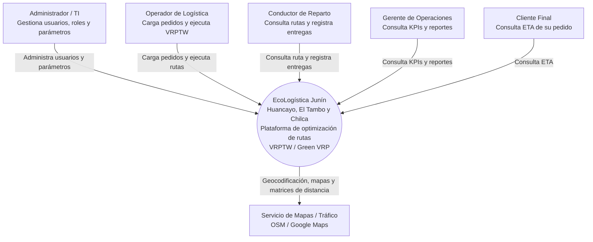
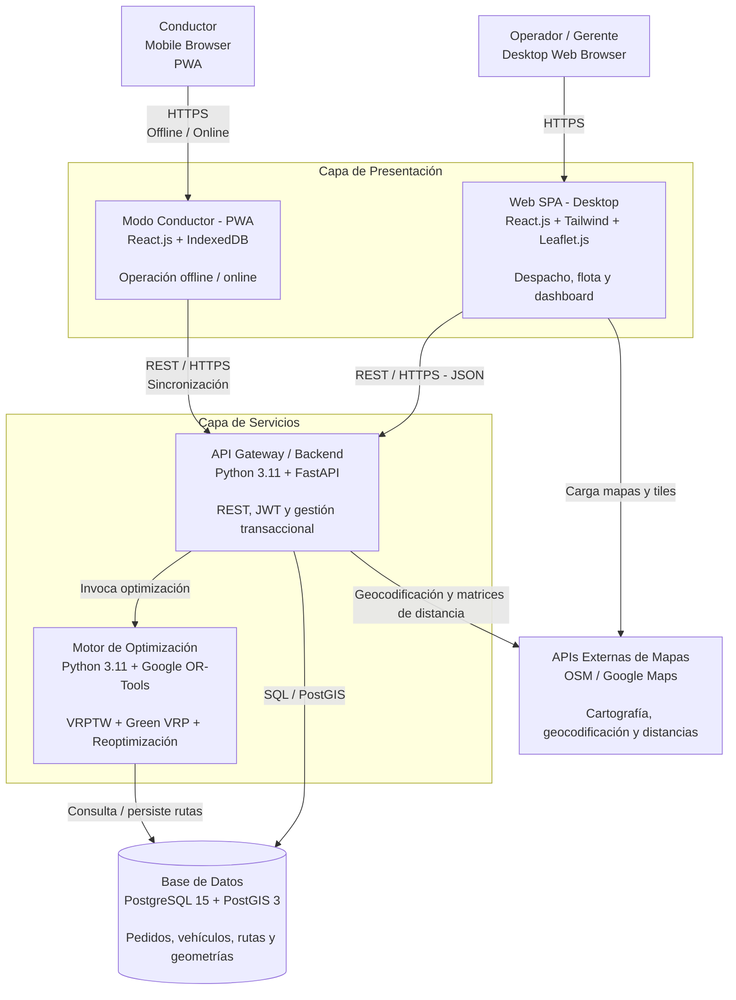
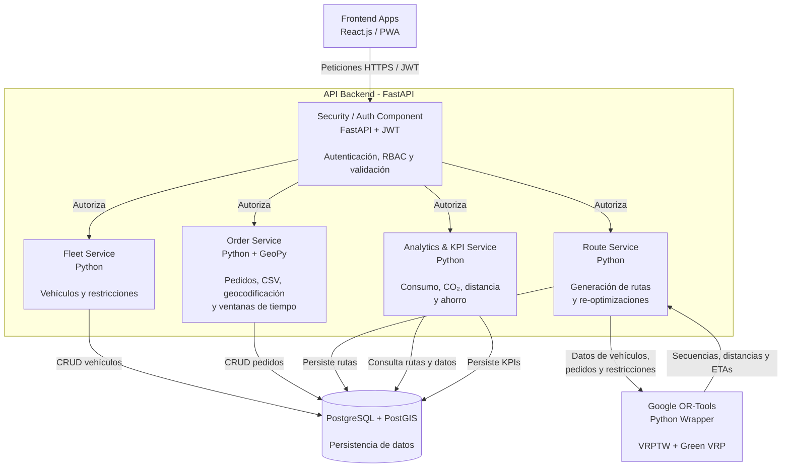

# 12. Modelo C4 V_1_0_3

## Nivel 1 — Diagrama de Contexto

---

## Nivel 2 — Diagrama de Contenedores

---

## Nivel 3 — Diagrama de Componentes del Backend

---

## Descripción general

El modelo C4 de **EcoLogística Junín** representa la arquitectura de la plataforma en tres niveles:

1. **Nivel 1 — Contexto:** identifica los actores externos, el sistema principal y los servicios externos con los que interactúa.
2. **Nivel 2 — Contenedores:** muestra las principales aplicaciones, servicios, motor de optimización y base de datos que conforman la solución.
3. **Nivel 3 — Componentes:** detalla los principales componentes internos del backend desarrollado con FastAPI.

### Tecnologías principales

| Componente | Tecnología |
|---|---|
| Aplicación web | React.js + Tailwind CSS |
| Mapas en frontend | Leaflet.js |
| PWA del conductor | React.js + IndexedDB |
| Backend | Python 3.11 + FastAPI |
| Autenticación | JWT + RBAC |
| Optimización | Google OR-Tools |
| Base de datos | PostgreSQL 15 |
| Información espacial | PostGIS 3 |
| Cartografía | OpenStreetMap / proveedor externo |
| Protocolo de comunicación | REST / HTTPS / JSON |

### Alcance geográfico

La plataforma está orientada a la gestión y optimización de rutas de distribución en:

- Huancayo
- El Tambo
- Chilca

El sistema considera restricciones de capacidad, ventanas de tiempo, características de la flota y criterios de sostenibilidad mediante la aplicación de **VRPTW (Vehicle Routing Problem with Time Windows)** y **Green VRP (Green Vehicle Routing Problem)**.
